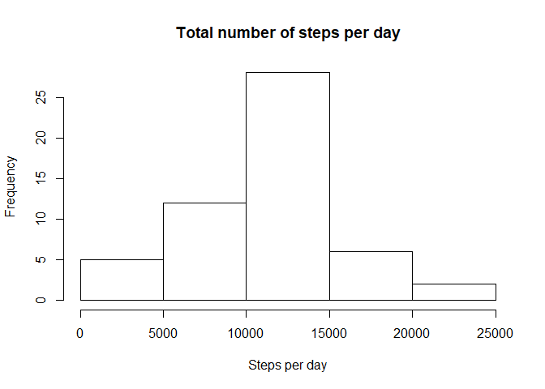
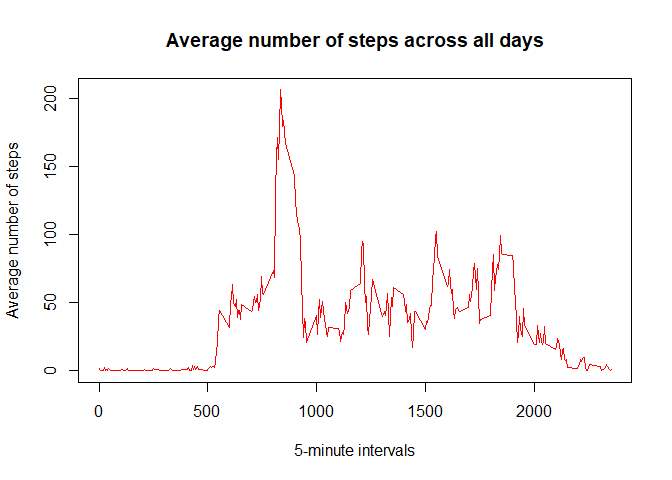
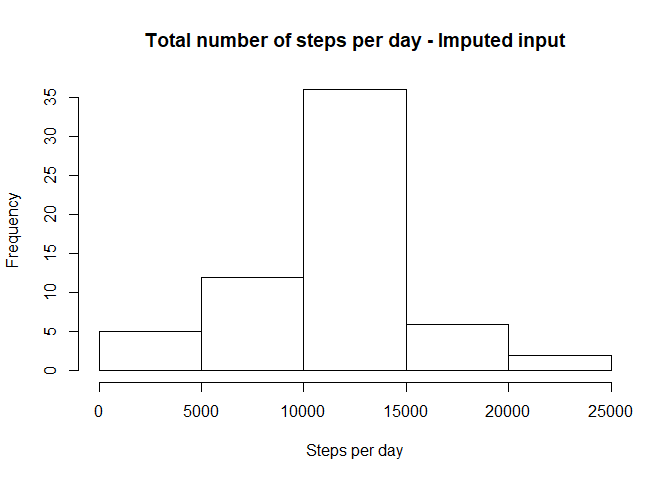
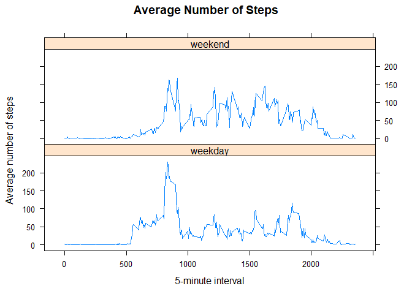

Reproducible Research - Peer-graded Assignment: Course Project 1
================================================================


## Loading and preprocessing the data
NOTE: It is assumed datafile is in the working directory

```r
activityDT <- read.csv("activity.csv")
```


## What is mean total number of steps taken per day?
1. Calculate the total number of steps taken per day, exclude null records


```r
StepsPerDay <- aggregate(steps ~ date, activityDT, sum, na.rm=TRUE)
```

2. Create a histogram of no of steps per day

```r
hist(StepsPerDay$steps, main = "Total number of steps per day", 
     xlab = "Steps per day")
```

<!-- -->

3. Calculate the mean and median of the total number of steps taken per day

```r
meanStep <- format(round(mean(StepsPerDay$steps),2),scientific = FALSE)
medianStep <- round(median(StepsPerDay$steps),2)
```

Mean of the total number of steps taken per day  : **10766.19**  
Median of the total number of steps taken per day: **1.0765\times 10^{4}**


## What is the average daily activity pattern?
1. Calculate average steps per interval for all days 

```r
avgStepsPerInterval <- aggregate(steps ~ interval, activityDT , mean, na.rm=TRUE)
```

2. Plot the time series with appropriate labels and heading

```r
plot(avgStepsPerInterval$interval, avgStepsPerInterval$steps, type='l', 
col=2, main="Average number of steps across all days", 
xlab="5-minute intervals", ylab="Average number of steps")
```

<!-- -->

3. Interval, on average across all the days in the dataset, contains 
the maximum number of steps


On average, interval with maximum number of steps: **835**


## Imputing missing values
1.Total number of rows with missing values in the dataset

```r
sum(!complete.cases(activityDT))
```

```
## [1] 2304
```

2. Strategy for missing steps: Replace $\color{red}{\text{NA}}$s with the mean 
step value of that 5-minute interval  

3. Create a new dataset that is equal to the original dataset but with the 
missing data filled in

```r
activityImputDT       <- activityDT
activityImputDT$steps <- ifelse(is.na(activityImputDT$steps), 
                                avgStepsPerInterval$steps[avgStepsPerInterval$interval %in% 
                                activityImputDT$interval],activityImputDT$steps)
```

4. Make a histogram of the total number of steps taken each day and Calculate 
and report the mean and median total number of steps taken per day. 
+ Create a histogram of no of steps per day

```r
StepsPerDayImput <- aggregate(steps ~ date, activityImputDT, sum)
hist(StepsPerDayImput$steps, main = "Total number of steps per day - Imputed input",
     xlab = "Steps per day")
```

<!-- -->

+ Calculate the mean and median of the total number of steps taken per day

```r
meanStepImput   <- format(round(mean(StepsPerDayImput$steps),2),scientific = FALSE)
medianStepImput <- format(round(median(StepsPerDayImput$steps),2),scientific = FALSE)
```
    Mean of the total number of steps taken per day after imputing  : **10766.19**  
    Median of the total number of steps taken per day: **10766.19**


+ Do these values differ from the estimates from the first part of the assignment?  
  What is the impact of imputing missing data on the estimates of the total 
  daily number of steps?

    The mean is same afer imputing however, the median differs **slightly**.  
    Since the data imputing strategy was to use the mean of 5-minute interval, 
    more data points with mean value are present which caused the meadian to be 
    closer to mean


## Are there differences in activity patterns between weekdays and weekends?

Note: Dataset with the filled-in missing values is use for this part. 
Lattice package will be used for plotting

1. Create a new factor variable in the dataset with two levels 
- "weekday" and "weekend" indicating whether a given deate is a weekday or weekend day.

```r
activityImputDT$daytype <- factor(ifelse(weekdays(as.Date(activityImputDT$date)) 
%in% c("Saturday", "Sunday"), "weekend", "weekday"))
```

2. Make a panel plot containing a time series plot of the 5-minute interval 
(x-axis) and the average number of steps taken, averaged across all weekday days 
or weekend days (y-axis).


```r
avgStepsPerIntervalImp <- aggregate(steps ~ interval + daytype, activityImputDT, mean)
library(lattice)
xyplot(steps ~ interval | daytype, data=avgStepsPerIntervalImp, type = "l",
       layout = c(1, 2), 
       xlab = "5-minute interval", 
       ylab = "Average number of steps", 
       main = "Average Number of Steps")
```

<!-- -->

Looking at the plot above,   
    * It is clear that during the **weekends** activity level is higher for 
    longer period of time compared to the weekdays  
    * During **weekdays** there's a spike earlier in the day then activiy level
    drops to almost half of the spike
